# 화면

실제로 띄운 서버를 한 바퀴 돌며 담은 화면입니다. 8개 커넥션(PostgreSQL · MySQL · MongoDB ·
Redis · SQLite ×2 · RabbitMQ · Kafka)과 2노드 클러스터(seoul 마스터 / busan 리플리카)가
붙어 있는 상태입니다.

> [문서 색인](README.md) · [프로젝트 README](../README.md)
>
> 호스트 이름·계정·파일 경로는 담을 때 **브라우저에서 다른 값으로 바꿨습니다**(작업용
> 컴퓨터의 이름과 경로를 문서에 남기지 않기 위해서입니다). 화면 구성과 수치는 실제 그대로입니다.

## 개요

### 대시보드

"지금 문제가 있는가"에 먼저 답합니다. 확인이 필요한 이벤트를 위에 올리고, 그 아래에
DB마다 최근 6시간 추이를 담은 카드를 놓습니다.

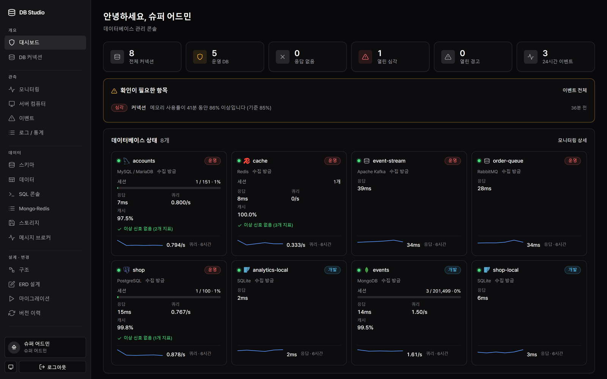

### DB 커넥션

서버를 먼저 놓고 그 아래에 DB를 답니다. 접속 정보와 자격증명은 서버의 것이고, 권한과
환경(개발·운영)은 DB마다 따로 붙습니다.

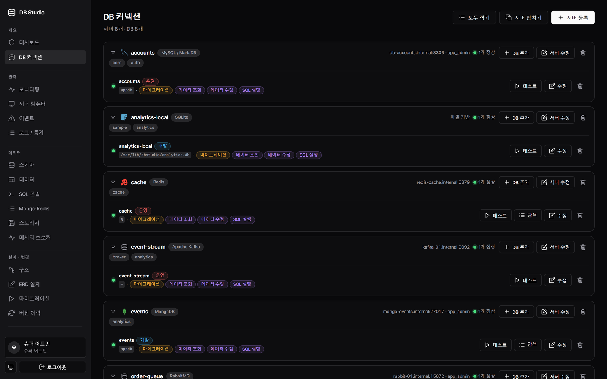

## 관측

### 모니터링

DB 종류마다 읽을 수 있는 지표가 다르므로, 같은 눈금에 올릴 수 있는 것만 공통 이름으로
모읍니다. 읽지 못한 값은 0으로 채우지 않고 사유를 적습니다.

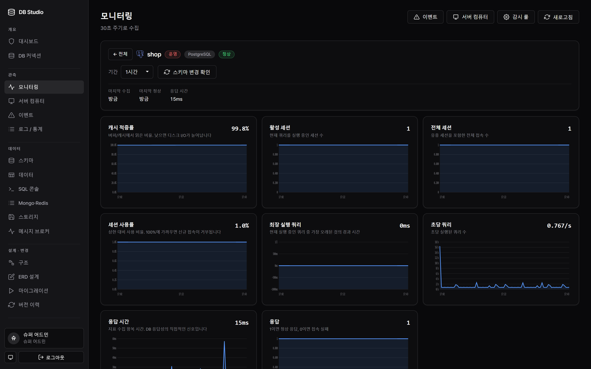

### 서버 컴퓨터

DB가 느린 원인이 DB 안에만 있지는 않습니다. 이 앱이 도는 기계의 CPU·메모리·디스크·네트워크와
OS 로그를 함께 봅니다.

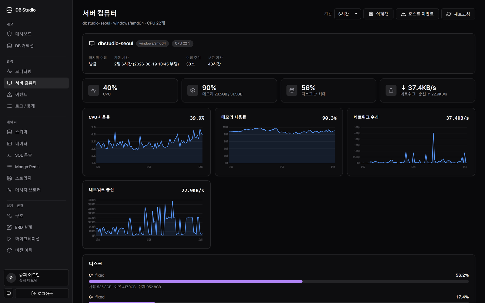

## 데이터

### 데이터 브라우저

외래키 컬럼을 누르면 대상 행이 **오른쪽에 펼쳐지고**, 거기서 또 따라가면 그 오른쪽으로
이어집니다. 수정은 모아 두었다가 실행될 SQL을 보고 한 트랜잭션으로 적용합니다.

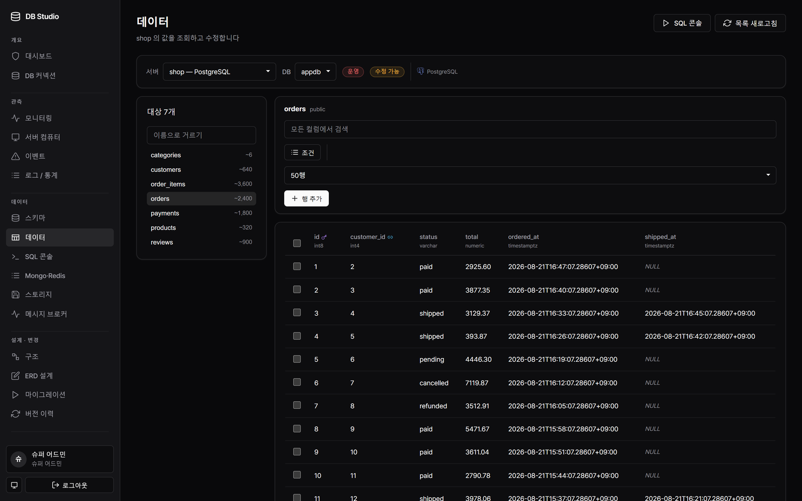

### SQL 콘솔

줄 번호, 구문 검사(실행하지 않고 문장을 준비만 해 확인), 포맷팅, 실행 계획.
읽기 전용 스위치가 기본으로 켜져 있습니다.

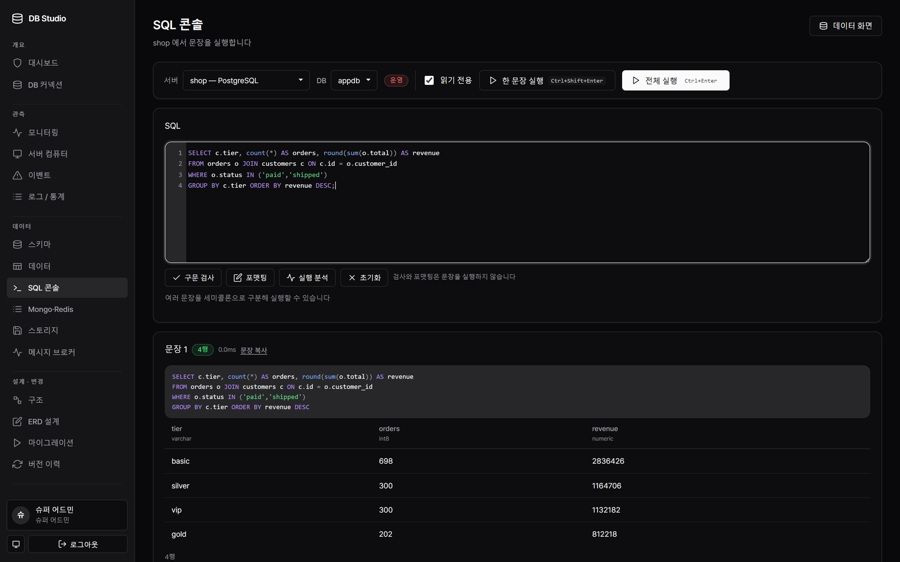

### Mongo · Redis

스키마가 없는 대상은 표가 아니라 그 나름의 구조로 보여줍니다 — 컬렉션의 문서, 키 접두사
그룹과 TTL.

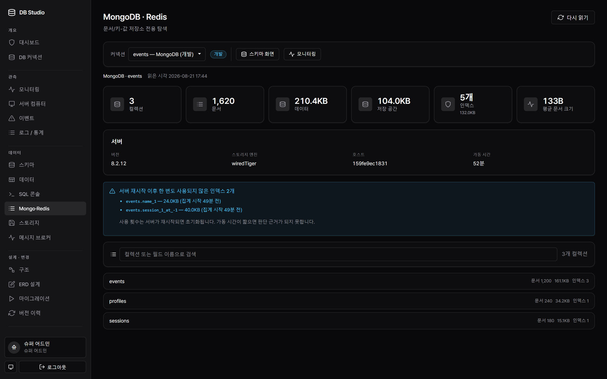

## 설계 · 변경

### 구조

연결된 DB의 현재 스키마를 ERD로 봅니다. 여기서 "이 구조로 초안 만들기"를 누르면 설계로
넘어갑니다.

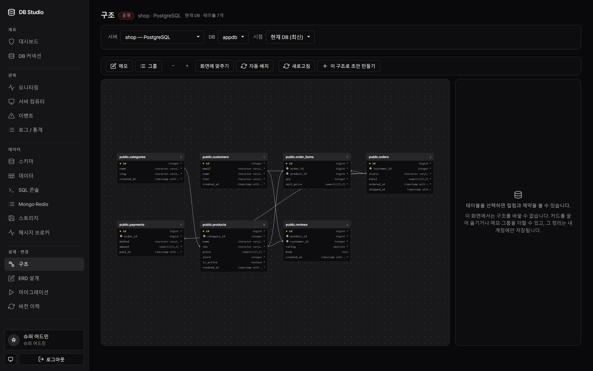

### ERD 설계

같은 문서를 여러 명이 동시에 고칩니다. 참여자 커서와 대화가 있고, 되돌리기는 **내가 한
편집만** 물러납니다. 그린 것은 설계도이고, 실제 DB는 마이그레이션을 실행할 때만 바뀝니다.

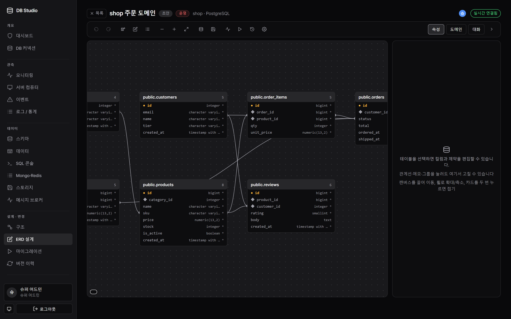

## 운영

### 클러스터

마스터가 메타 DB의 주인이고, 리플리카는 그 내용을 복제해 조회를 처리합니다. 노드마다
복제 지연과 그 서버 컴퓨터의 상태를 한 화면에서 봅니다.

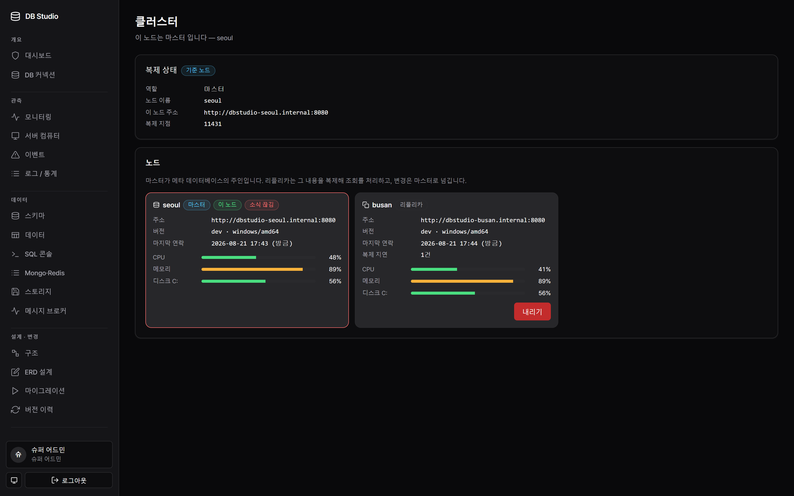

### 메시지 브로커

첫 질문은 "쌓이고 있나"입니다. 밀린 메시지와 그것을 줄이는 쪽(소비자)을 나란히 놓고,
**메시지는 있는데 소비자가 없는** 큐를 따로 표시합니다.

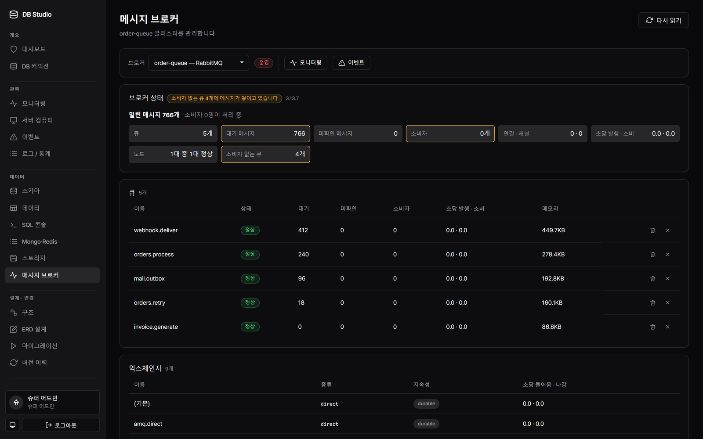

### 설명서

앱 안에 들어 있습니다. 바이너리에 임베드되므로 화면과 설명의 버전이 갈리지 않습니다.

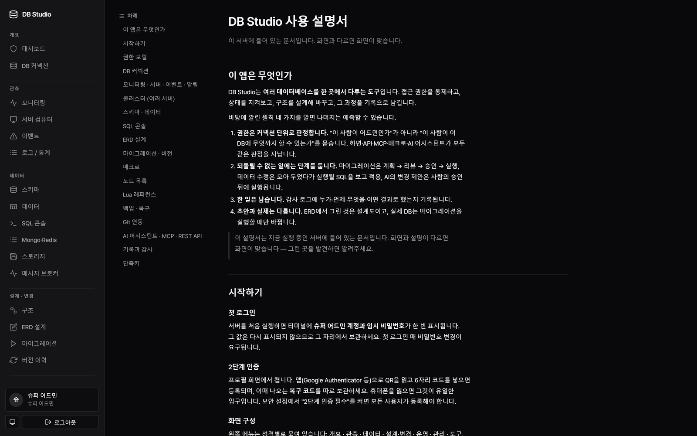
